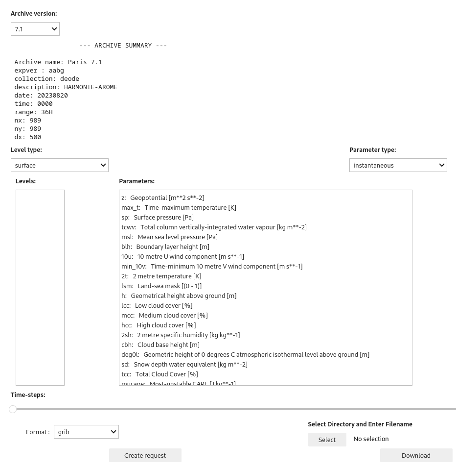
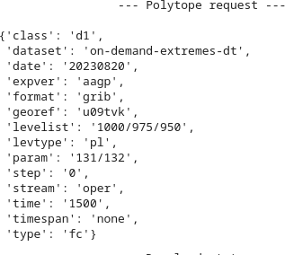
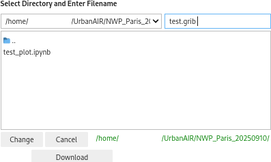

# NWP demo data
Documentation with Python and Jupyter notebook examples for UrbanAir NWP data. Data can be
accessed in three ways:

 1. Via http URL's from nsc.liu.se. This includes all data stored as files
    * NB: Not available for data versions "9.0" and above
 2. Using ECMWF's polytope API. This does not yet cover the tiled surface data
 3. Using FDB directly on ECMWF's HPC. This does not yet cover the tiled surface data

The two latter enables field extractions whereas the first works with files.

## Install

To install the demo e.g. locally do, in this case with micromamba, and preferred python version

```
python_version=3.10
micromamba create -n urbanair_demo python=3.10
micromamba env update -n urbanair_demo -f environment.yml
micromamba activate urbanair_demo

# Create a kernel for jupyer notebook
python3 -m ipykernel install --user --name=urbanair_demo
```


### List info about the latest version
```
python3 ./versions.py
```

## Download method 1: urls
You can list all available data and some of their properties by

```
>python3 ./download.py -l | less

-- Data versions available for direct (url) download  --

version : 4

{'metadata': {'dx': 500, 'nx': 139, 'ny': 139},
 'name': 'Antwerpen test',
 'url': 'http://exporter.nsc.liu.se/28e80f79cad547988e7a0b64809e0dc3'}
version : 5.0

{'metadata': {'dx': 500, 'nx': 139, 'ny': 139},
 'name': 'Antwerpen',
 'url': 'http://exporter.nsc.liu.se/1c333ab5ee374ab2acb470b2870cc02e'}
version : 6.1

{'metadata': {'dx': 500, 'nx': 989, 'ny': 989},
 'name': 'Paris',
 'url': 'http://exporter.nsc.liu.se/284818358def438b8c142f4223c96936'}
version : 7.1
```

Download the version you're interested in, e.g. Paris, to the `data` directory by:

```
python3 ./download.py -v 8.0
```
Note that this would download the *full* dataset to `data\`

## List file content
After install the above mentioned environment and downloaded the GRIB files can be listed with `grib_ls` as e.g.

```
>grib_ls data/4/GRIBPFDEOD+0000h00m00s  | head -5
data/4/GRIBPFDEOD+0000h00m00s
edition      centre       date         dataType     gridType     stepRange    typeOfLevel  level        shortName    packingType
2            lfpw         20240811     fc           lambert_lam  0s           surface      0            sd           grid_ccsds
2            lfpw         20240811     fc           lambert_lam  0s           surface      0            t            grid_ccsds
2            lfpw         20240811     fc           lambert_lam  0s           surface      0            h            grid_ccsds
```

## Download method 2: polytope (recommended)

The notebook `polytope_helper.ipynb` can be used to interactively filter and
select from the archived data, it also includes a "Download" feature to
download the selected data to a user-defined file path. Polytope allows you to
download to your local machine or HPC cluster. It also allows for *feature
extraction*, shown in a later example.


### Polytope access
To use polytope put your ECMWF web API key, https://api.ecmwf.int/v1/key/ in a ~/.polytopeapirc file as

```
{
  "user_key" : "your key from https://api.ecmwf.int/v1/key/",
  "user_email" : "foo.bar@somewhere.ok"
}
```
If you do not yet have an ECMWF account please contact the NWP group.


### Creating requests and downloading
With `polytope_helper.ipynb` open in
your jupyter notebook, select `Kernel` > `Restart Kernel and Run All Cells...`.
The selection cell should look like:



The following sequence is used to select and download data:

1. Select `Archive version` (drop-down menu). Metadata is updated in the `--- ARCHIVE SUMMARY ---` box.
2. Select the `Level type` and `Parameter type` (drop-down). Note the available `Levels`, `Parameters` and `Time-steps` change for each combination.
3. Select `Levels` and `Parameters` (multi-select: ctrl+click or shift+click).
4. Select `Time-steps` (range slider: click+drag handles)
5. Chose `Format` (drop-down: grib/netCDF)
6. Click `Create request`, a polytope/fdb request is created and displayed in the box below:

    
  * If the `Create request` box is greyed out, the reason will be shown in the output below, eg:
    ```
          --- INFO ---
      Cannot make request:
       * Chosen paramters were stored at different frequencies
       * No levels chosen
    ```


7. Under `Select Directory and Enter Filename`, click `Select`. A path selection tool appears as so:

    

    Provide a filename and click `Select` / `Change`

8. Click `Download`

The downloaded GRIB file can be inspected with `grib_ls`, e.g:

```
$ grib_ls test.grib
test.grib
edition      centre       date         dataType     gridType     stepRange    typeOfLevel  level        shortName    packingType
2            ecmf         20230820     fc           lambert_lam  0s           isobaricInhPa  1000         u            grid_ccsds
2            ecmf         20230820     fc           lambert_lam  0s           isobaricInhPa  1000         v            grid_ccsds
2            ecmf         20230820     fc           lambert_lam  0s           isobaricInhPa  975          u            grid_ccsds
2            ecmf         20230820     fc           lambert_lam  0s           isobaricInhPa  975          v            grid_ccsds
2            ecmf         20230820     fc           lambert_lam  0s           isobaricInhPa  950          u            grid_ccsds
2            ecmf         20230820     fc           lambert_lam  0s           isobaricInhPa  950          v            grid_ccsds
6 of 6 messages in test.grib

6 of 6 total messages in 1 files
```
Note that multiple time-steps, if selected, will be written to the same grib/netCDF file.

## Download method 3: fdb (on ECMWF)

One can use `pyfdb`
(https://sites.ecmwf.int/docs/fdb/develop/pyfdb/index.html) on ECMWF clusters.
An example of extraction using this is given in `polytope_fetch.ipynb`. The following is required for the correct environment variables:

```
$ module load ecmwf-toolbox
```
Following this, it is necessary to reload the python Kernel. Set `INPUT_SOURCE = "fdb"` for extraction using fdb.  The polytope request made using Method 2
above can also be be copy-pasted here.


## Inspect and download in jupyter notebooks

### Paris

For Paris we have four examples valid for runs >=v7.1

 - earthkit_example_paris.ipynb : Downloads from NSC storage
 - earthkit_example_paris_polytope.ipynb: Downloads using polytope or fdb directly on atos
 - paris_time_height_plot.ipynb : Downloads using poltype/fdb and creates a time-heigh plot
 - paris_time_height_plot_subhour_200m.ipynb : Example with 30s output frequency over a smaller domain, only available from within ECMWF

Run with e.g.
```
jupyter notebook ./earthkit_example_paris.ipynb
```

This will open the demo in your browser

## Create toc from fdb
Run fdb.scan.py with correct expver to create a json with all parameters
stored. Remember to load the latest ecmwf-toolbox before you run
